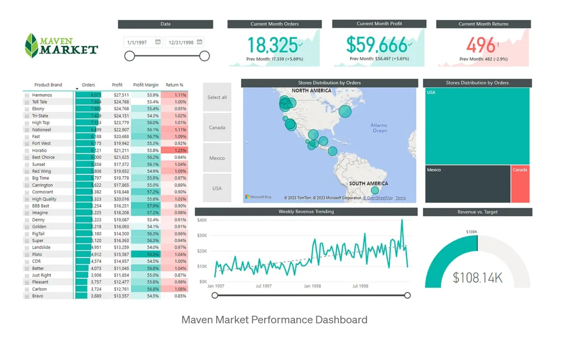
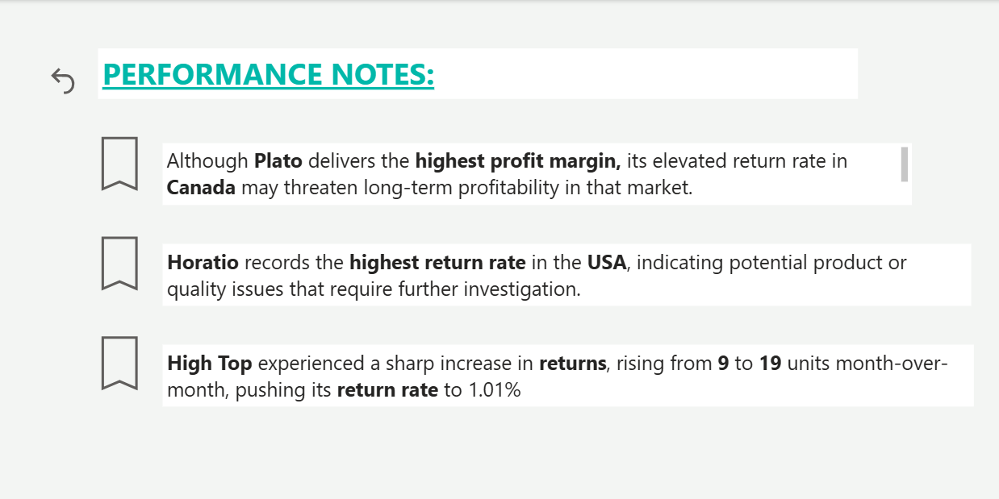
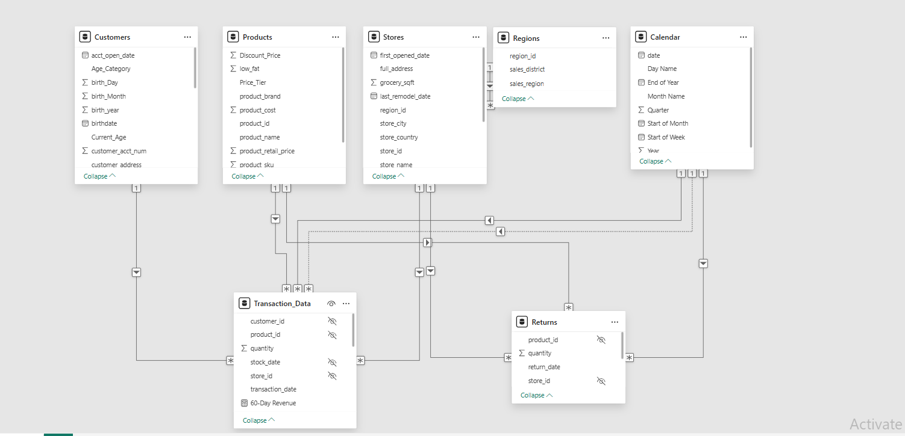
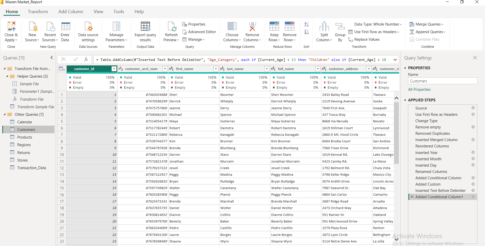

# Maven Market Sales & Performance Analysis (Power BI)

---

## Project Overview

Maven Market is a fictional multi-national grocery chain operating in Canada, Mexico, and the United States.

This project analyzes transactional data to evaluate sales performance, product profitability, customer behavior, and revenue trends. An interactive Power BI dashboard was developed to support management in making data-driven decisions.

---

## Business Problem

Management aims to leverage transaction data to improve performance monitoring, product evaluation, and regional efficiency.

The dashboard was designed to answer:

- What were the top 30 brands by transaction volume?
- How did transactions, profit, and returns compare to last month?
- Which countries and stores generated the most transactions?
- What was the weekly revenue trend?
- Did revenue exceed target?

---

## Data Sources & Modeling

The data model was built using 8 raw CSV files:

- Transactions (2 files 1998-1997)
- Returns
- Products
- Customers
- Stores
- Regions
- Calendar

A star schema was implemented with `Transaction_Data` as the central fact table, connected to dimension tables including Products, Customers, Stores, Regions, and Calendar.

The calendar table was enhanced using date intelligence techniques, adding:

- Start of Week
- Start of Month
- Month Name
- Year and Quarter fields

---

## Data Preparation (Power Query)

Data cleaning and transformation steps included:

- Merging transaction files
- Handling data types and formatting
- Creating calculated columns (e.g., Price Tier)
- Building a full address field for store analysis
- Enhancing the calendar table with derived date columns

---

## DAX Measures

Key measures developed for performance tracking:

- Total Revenue
- Revenue Target
- Revenue Gap
- Total Transactions
- Total Profit
- Profit Margin
- YTD Revenue
- 60-Day Revenue
- Return Rate

## Key Insights

- Overall revenue exceeded target by **$34.15K**, indicating strong aggregate performance.
- The United States generated the highest transaction volume across all regions.
- Plato delivers the highest profit margin, but its elevated return rate in Canada may pose long-term profitability risks.
- Horatio records the highest return rate in the USA, suggesting potential product or quality concerns.
- High Top experienced a sharp month-over-month increase in returns, signaling a recent performance shift.

---
Tools Used

Power BI Desktop

DAX 

Power Query

Data Modeling (Star Schema)

CSV Data Sources
## Conclusion

This project demonstrates the ability to transform raw transactional data into structured insights using Power BI. 

It showcases skills in data modeling, DAX calculations, trend analysis, performance evaluation, and executive-level reporting.

--- 
---

## Dashboard Preview

### Topline Performance Dashboard

### Key Performance Highlights

---

## Data Model

---

## Power Query Transformations

